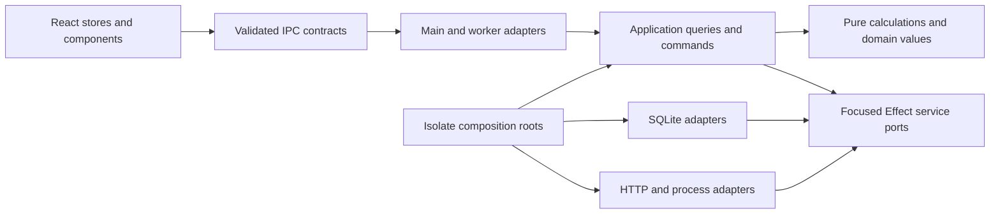

# Effect target architecture and product completion plan

This extends [the September 30 assessment](../research/effect-adoption-assessment-2026-09-30.md) and [issue #148](https://github.com/Pasquale-Favella/watchtower/issues/148). It specifies the target of the authorized Zod replacement and backend restructuring. Implementation starts from local commit `ce81593`, which includes ledger Schema Wave A. Names below describe responsibilities; the execution record distinguishes implemented work from remaining work.

Full Effect adoption is complete when contracts have one Schema authority, application workflows compose ports, each isolate owns its resources, and product operations avoid redundant work. A library substitution alone does not establish those properties.

## Dependency direction

Arrows mean dependency or composition. An adapter implements a port; application code depends on the port interface. The roots select implementations. SQL and process objects do not enter domain calculations or wire payloads.

| Responsibility            | Owns                                                                              | Must not depend on                                              |
| ------------------------- | --------------------------------------------------------------------------------- | --------------------------------------------------------------- |
| Shared contracts          | Encoded IPC inputs/outputs, portable domain shapes and reusable field schemas     | Electron, Node IO, SQL clients, live services, React components |
| Pure calculation          | Pricing precedence, turn/session aggregation, Section calculations and formatting | Repository classes, runtime execution, mutable module config    |
| Application               | Query loading, commands, fallback policies, cancellation and resource use         | Concrete SQLite/client implementations or Electron callbacks    |
| Infrastructure            | SQL, HTTP, files where effectful, process transport, local log forwarding         | React stores or Section presentation                            |
| Composition and transport | Runtime/layer construction, boot, protocol mapping and shutdown                   | Hidden per-workflow dependency construction                     |
| Renderer                  | React state, Promise calls, synchronous Schema decoding and visible errors        | Backend runtime, fibers, ledger access                          |

Apply these boundaries in existing modules first. Moving every file before separating responsibilities makes review harder. After behavior is stable, consolidate application queries, pure ledger calculation, and SQL adapters into explicit directories. Keep established import paths through temporary re-exports only when necessary, and give each re-export a deletion condition.

A gradual module layout can keep roots in `main-runtime.ts` and `worker-runtime.ts`, transport in `db-worker/` and IPC modules, query workflows in a focused `ledger/queries.ts`, pure calculation in `ledger/aggregation.ts`, and SQL/row codecs in `store/`. These paths are proposed destinations, not a required bulk rename. Split current mixed responsibilities before moving them. Internal SQL row codecs should not import wire/renderer adapters; portable domain types and wire contracts stay under `shared/` where both targets actually need them.
A workflow such as GetOverview is a named Effect function consuming services. It does not require its own service tag. A capability such as LedgerQueries or a scoped process factory earns a tag because it has a substitutable implementation or an owned resource.

## Schema authority and decoding policy

[ADR 0034](../adr/0034-effect-schema-contract-authority.md) records the authorized replacement. Distinguish representation and validation ownership:

| Data                         | Authority and owner                                                 | Failure policy                                                                          |
| ---------------------------- | ------------------------------------------------------------------- | --------------------------------------------------------------------------------------- |
| Provider input               | Extraction schema, decoded by extraction adapter                    | Skip the malformed unit, increment the existing tally, retain the remainder of the scan |
| Cache/file content           | Cache codec, decoded by cache adapter                               | Apply the existing invalid-cache/reparse policy explicitly                              |
| SQLite rows and JSON columns | Projection/row codec, decoded by repository                         | Typed decode failure; corruption cannot become a successful empty ledger                |
| Decoded calculation input    | Domain types derived from relevant schemas                          | Already validated; calculation does not repeatedly decode the same values               |
| IPC request/result/event     | Wire schema, decoded at the owning transport/trust boundary         | Preserve operation envelope, rejection policy and renderer tripwire                     |
| Trusted UI-only values       | Plain types or Schema-derived types where a runtime contract exists | No artificial runtime validation for component constructors                             |

A row codec can map snake_case columns and JSON strings to decoded values. It cannot be reused as a wire validator if the wire already contains decoded camelCase fields and arrays. State `Type` and `Encoded` for every transforming contract and identify which representation actually crosses the boundary. Preserve existing Date/structured-clone behavior; do not apply JSON encoding to all channels as a migration shortcut.

Use `Schema.decodeUnknownEffect` where application Effects must preserve typed failures. Use synchronous `Schema.decodeUnknownResult` at pure extraction and renderer boundaries. Its rc.115 implementation returns Schema mismatches as Result failures but can still throw defects or non-schema failures. Transformations must not throw on expected malformed inputs, and the existing renderer fetch/event guards still need to contain unexpected decoder defects. Wire schemas must have no asynchronous decoding or service requirements. Never start a runtime solely to validate a renderer payload.

Share field definitions where representations agree. Derive a narrower projection rather than decoding a wide row and discarding fields. Projection schemas and payload schemas may legitimately differ; they are contracts for different data. Avoid two independent definitions of the same contract or permanent Zod-compatible wrappers around Effect Schema.

The recorded migration rules remain mandatory: finite numbers, explicit coercion, `Schema.Literals`, transformation order, optional/null semantics, mutable arrays where consumers require them, defaults, record intersections, and JSON errors. Verify both acceptance and decoded values. Error paths and labels shown by renderer helpers also require an intentional translation; replacing `.issues[0]` by a full issue dump can expose raw data and change the error experience.

Inventory imports and consumers from the live source. Historical schema counts are a baseline, not an implementation checklist. Work in dependency order: shared scalar shapes and internal contracts, row/projection codecs, payload contracts, then their renderer adapters and remaining UI-only definitions. Convert one contract and all consumers together. The final removal gate includes src, tests, scripts, generated code/configuration and direct package declarations, followed by a lockfile update through the package manager.

### Transition at shared decoding helpers

The renderer's generic fetch/event helpers currently require ZodType. The first migrated wire contract therefore needs a temporary decoder seam before the last Zod contract can disappear. Give the generic helpers an inferred decoder function with a normalized success/failure result. Each call supplies the decoder for its single authoritative contract. An unmigrated contract uses its existing Zod decoder; a migrated contract uses Effect Schema. No contract is defined in both libraries.

Name the seam's removal condition: after all contracts used by the shared helpers migrate, remove the Zod decoder adapter and make the remaining helper interface Effect Schema-native. Preserve synchronous event handling and visible error labels throughout. This is a temporary interoperability boundary, not a permanent abstraction over two schema libraries.

Wave A and Wave B describe consumers, not mandatory global barriers. Inventory actual runtime and type dependencies. A leaf wire contract can migrate before unrelated internal parser modules once its helper seam and consumers are ready. Contract ownership and dependency order determine the commit boundary. Capture the prior schema verdicts/decoded values before replacing it, so parity can be reviewed without leaving parallel production definitions.

### MCP registration is a separate migration dependency

The installed `@modelcontextprotocol/sdk` high-level registration API takes Zod shapes. `server/zod-compat.d.ts` defines AnySchema as Zod v3 or v4, rather than a generic Standard Schema. Watchtower's `ledger-mcp/tools.ts` and `prompts.ts` explicitly expose ZodRawShape, and `server.ts` passes these to registerTool/registerPrompt. Effect Schema cannot be substituted by a cast or by changing the shared overview schema alone.

Before migrating these shared inputs, evaluate an SDK adapter that advertises JSON Schema generated from the authoritative Effect request schemas and decodes tool arguments with Effect. One candidate is the official SDK Server request-handler API using its exported protocol request schemas. Keep official transport, negotiation and error handling under ADR 0020; this is not authorization to write a JSON-RPC implementation. The evaluation must cover tools/list and call, resources, prompts, malformed args, metadata generation, protocol errors and cleanup, with a recorded verdict before implementation. A generated metadata projection is allowed; manually maintaining another validation schema for the same tool is not.

The SDK itself declares Zod and zod-to-json-schema dependencies and a Zod peer dependency. The completion gate is zero Watchtower-owned Zod contracts, imports and direct declaration after consumer conversion, with SDK-owned protocol validation documented at the adapter. Zod may legitimately remain in the dependency lockfile or package tree. Eliminating those transitive packages would require replacing or upgrading the SDK and a separate evaluation of protocol support. Do not label a lingering Watchtower tool schema as a third-party exception.

### MCP adapter evaluation, 2026-10-01

Verdict: use the installed SDK's exported `Server` for this advanced adapter. Its `setRequestHandler` API accepts the SDK's protocol request schemas. The SDK continues to own initialization, version negotiation, framing, request validation, protocol errors and transport shutdown. The six application handlers cover tools/list and call, resources/list and read, and prompts/list and get. No Watchtower JSON-RPC implementation or Effect-to-Zod cast is needed.

The installed `server/index.d.ts` marks `Server` deprecated for ordinary use and explicitly reserves it for advanced use cases. This adapter needs independent argument validation and generated metadata, which the high-level `McpServer` registration cannot provide without Zod tool shapes. Using `McpServer.server` alongside high-level registrations would give both layers ownership of the same handlers; `server/mcp.js` installs them from its private registration maps. Keep one handler owner and confine this SDK dependency to `agents/ledger-mcp/server.ts`.

In Effect rc.115, generate input metadata with `Schema.toStandardJSONSchemaV1(schema).jsonSchema.input({ target: 'draft-2020-12' })`. This projects the contract's Encoded input. Decode tool arguments with the same authoritative Effect schema, then pass decoded values to the tool. The SDK's own protocol schemas remain dependency-owned Zod values. Generated JSON Schema advertises inputs; it is not a separately maintained validator.

Preserve current error categories. The installed high-level handler returns `isError: true` for an unknown tool, invalid tool arguments and ordinary handler failures. Resource and prompt lookup failures remain SDK `InvalidParams` protocol errors. Malformed MCP envelopes and unknown protocol methods remain SDK errors. Verify these distinctions with a real SDK client, including absent arguments, metadata, known and unknown names, each tool's output, and both stdio and stateless Streamable HTTP. Check response/transport shutdown and read-only store ownership; closing a per-request server must not close the process-owned store.

Implementation depends on the renderer decoder transition and the shared scope contract. `overviewScopeSchema` has runtime consumers in `schemas/agents.ts` and `agents/ledger-mcp/tools.ts`. Convert those containing contracts and consumers together. The renderer stores import the scope type and need no refresh changes. Other dashboard payload schemas can migrate in later groups. `ledger://schema` is descriptive documentation; any generated tool argument section should reuse the advertised metadata rather than copy its validation rules.

This evaluation inspected the installed SDK and Effect sources and current consumers. It did not run a protocol experiment. The adapter is accepted for implementation; its behavior and cleanup remain acceptance gates.

## Eliminate work at its owner

There are several different costs. Track them separately:

- Runtime transitions caused by nested `runSync` or Promise adapters.
- SQLite statements and total rows/columns returned.
- Repeated JSON decoding and validation of those rows.
- Repeated reconstruction and pricing of the same facts.
- IPC requests triggered by shell and Section refresh.
- Re-validation at distinct trust boundaries, which must remain even when internal duplicates are removed.

Neither local Effect Cache nor RequestResolver removes a cross-process request automatically. A layer graph also does not make SQL statements parallel or an individual synchronous query interruptible.

| Operation and source evidence                       | Redundant work today                                                              | Target                                                                                                                                                  |
| --------------------------------------------------- | --------------------------------------------------------------------------------- | ------------------------------------------------------------------------------------------------------------------------------------------------------- |
| `buildAnalyticalViewsFromLedger`, `views.ts:84`     | Builds summaries, then the dashboard builds them again                            | Load one request snapshot; calculate both from it                                                                                                       |
| `buildOverviewFromLedger`, `overview.ts:725`        | Builds lifetime and scoped summaries independently                                | Reuse one snapshot initially; later obtain dataStart through a small semantically equivalent metadata query and scoped facts                            |
| `buildProjectRowsCore`, `views.ts:142`              | Calls `getSessions()` inside the source loop                                      | Read sessions and sources once, index by source/session, then join in memory or SQL                                                                     |
| `buildSessionSummaries`, `aggregate.ts:509`         | Reads sources in queryScope, then again for provenance                            | Include provenance in the loaded snapshot                                                                                                               |
| `getSessionDetailFromLedger`, `views.ts:265`        | Reconstructs the whole lifetime ledger to find one session                        | Read the facts needed for that session under the existing identity/selection semantics                                                                  |
| `searchSessionsFromLedger`, `views.ts:99`           | Reconstructs all sessions to search messages and bash commands                    | Purpose-specific search reads, bounded results and the existing matching/order policy                                                                   |
| `applyChange`, renderer `scan-store.ts:77`          | Fetches full analytics for provider names before notifying all initialized stores | Reduce backend analytics work; evaluate a small shell metadata query through an explicit additive contract. Preserve the existing store implementation. |
| `scopedDataSlice.load`, renderer `data-store.ts:40` | Same-scope requests all pass the scope-only response guard                        | Assess actual IPC ordering and record any remaining limitation. Preserve the existing store implementation.                                             |

The project source loop is a source-confirmed N+1 read pattern, not a measured duration. It was not part of the original `store:views` benchmark. Eliminating it has its own statement-count acceptance criterion and needs no general cache.

The same-scope response race is a source-level finding. Scope identity distinguishes different filters but not two refreshes for the same filter. The owner rejected added renderer coordination. Assess whether actual worker dispatch can return these responses out of order before specifying further work; the restored stores do not establish newest-request ownership.

## Query composition and consistent pricing

Load a request snapshot containing the projected facts, source/session provenance, aliases, price overrides, pricing catalogue snapshot and a captured query time. Pure calculations consume it explicitly. Carry compound source/session/turn identity internally. Preserve existing external session ids and selection behavior unless a separate contract change is specified.

Obtain a coherent set of database facts and config on the owning thread. If multiple SELECTs must represent one read unit, execute the complete unit under the existing synchronous boundary and the required SQLite transaction policy. Do not introduce Promise waits or Effect scheduler yields while that transaction is open. Capture pricing state and query time for the same application operation, then release database ownership before expensive calculation or export file IO.

Start with request-level sharing. Its lifetime ends with the operation and it needs no cache invalidation. Summaries and dashboard calculation must accept loaded data rather than call the repository again. Models and other Sections use the same pure price resolver with an explicit config/catalogue snapshot. Preserve ADR 0033's recorded-cost, alias, override, reasoning, tier and fallback rules.

Push down provider and time filtering only after defining the semantic query unit. The current scope includes a complete turn by its first assistant call timestamp. Filtering individual calls can change totals. Search/detail retain prompt text when necessary; summary projections omit it only after consumers stop requiring it. SQL grouping can reduce rows decoded, even though merely replacing the existing JS calculation has a small measured ceiling.

Do not load the full ledger and then wrap it in a Stream to claim bounded memory. Bounded reads require SQL predicates, projections, pagination or cursor batches. Cursor consumption must release every statement/resource and preserve export order and per-operation consistency.

## Cache and refresh policy

ADR 0008 currently excludes per-query caching. Request-level reuse is the first implementation target. A cache shared across requests is a proposed extension, requiring an explicit ADR amendment and evidence that projection and request reuse are insufficient.

If adopted, its key includes normalized scope, relevant data/config/pricing revision and any query-time input such as a date boundary. Its memory budget accounts for returned rows and summaries, not only entry count. Never retain a second full copy of the lifetime ledger to hide repeated reads. Cache only deliberate reusable results, evict them under a bounded policy, and avoid retaining rejected or cancelled fills.

Advance data/config revisions after committed relevant writes, including per-file ingest if queries can observe partial scans, clear/delete, aliases and overrides. Preserve atomic ordering between the commit, revision publication and notifications. Currency-dependent output needs its own freshness input or conversion after a cached USD calculation. A pricing refresh and passage across midnight can invalidate results without a new ledger row.

A sidecar has a separate connection and cannot rely on a worker-local revision. Keep its reuse request-local unless there is a database-visible revision/freshness protocol. No new scan-time materialized derived costs are introduced; ADR 0002's raw-fact ledger and instant config repaint remain requirements.

Owner correction during implementation: preserve the existing `data-store.ts` and `scan-store.ts` implementations. Request counters, Promise ownership and refresh coordination variables in these stores were rejected and restored. F35/F36 remain source findings to assess against actual IPC ordering; no added renderer coordination is scheduled. Continue reducing backend reads and consider the separately specified shell metadata query. Schema conversion may update contract imports without adding refresh machinery. Changing eager refresh policy still requires an ADR 0011 update.

## Effect patterns selected for a reason

| Pattern                                       | Apply it to                                               | Constraint                                                                                          |
| --------------------------------------------- | --------------------------------------------------------- | --------------------------------------------------------------------------------------------------- |
| `Context.Service` and Layer construction      | Repository ports, pricing state, IO and process factories | Dependencies enter through interfaces or layer requirements; no AppServices mega-interface          |
| `ManagedRuntime`                              | Main, worker and read-only MCP roots                      | One application-owned graph per isolate; adapters execute there                                     |
| `Effect.fn` and `fnUntraced`                  | Application spans and cheap helpers respectively          | Trace query/transaction operations, rather than each row                                            |
| `Schema.TaggedError`, Exit and Cause handling | Expected operational failures and boundary mapping        | Keep typed failures, interruption and defects distinct; no empty-success corruption fallback        |
| Scope and `acquireRelease`                    | Connections, process handles and owned subscriptions      | Finalizers must work while an external Promise/iterator is pending; use the independent stop handle |
| Fibers and owned handles                      | Scan, cadence, probes and Coach pump                      | Cancellation stops underlying work and drains it before releasing resources                         |
| Deferred or a bounded queue                   | Actual single-flight/coalescing or incremental delivery   | Specify failure/reset/latest-request semantics before choosing a primitive                          |
| Schedule and Clock                            | Existing retry/cadence and captured operation time        | Retry only allowed transient outcomes; do not retry an aborted write or scan                        |
| `Effect.all` with bounded concurrency         | Independent network/process work                          | No fan-out over one synchronous SQLite writer merely to use concurrency                             |
| Stream                                        | Incremental scan/export/Coach IO with real backpressure   | Bounded input and cleanup policy required; avoid wrapping already materialized arrays               |
| Cache or RequestResolver                      | Measured repeated/batched demand                          | Defer until freshness, key, size and ownership contracts exist                                      |
| Logger and Tracer over an injected sink       | Local operation/counter observation in each isolate       | Forward worker records to main; keep the allowlist and no exporter policy                           |

RcMap, generated SqlModel and unstable RPC remain outside this plan under their recorded verdicts. Effect Schema authorization does not reverse those verdicts. Test support must match the pinned rc.115 APIs.

## Structural and product gates

When implementing these slices, verify properties that users depend on. The checks below are future acceptance work; none was run for this document.

| Gate              | Observable acceptance                                                                                                                                                                 |
| ----------------- | ------------------------------------------------------------------------------------------------------------------------------------------------------------------------------------- |
| Query work        | Analytics has one summary load per request; project session reads do not grow with source count; detail reads avoid unrelated session facts                                           |
| Runtime ownership | One worker writer connection and runtime; MCP read-only connection; initialization and teardown counted exactly once                                                                  |
| Contract parity   | Valid/invalid verdict and decoded output parity, deliberate JSON error changes, renderer error states and broadcast dropping preserved                                                |
| Freshness         | Aliases/overrides repaint without rescan; pricing refresh and date rollover produce current derived results; assess actual IPC response ordering while preserving the original stores |
| Cancellation      | Stuck next/return and delayed parse callbacks cannot retain registries, emit late events or write after connection release                                                            |
| Performance       | Rerun comparable 1k/50k/500k operations; record median/range, statements, rows, bytes decoded, heap/RSS and IPC payload size                                                          |
| Structure         | Pure calculation imports no repository/runtime/live IO; application imports ports; live wiring stays at roots; tests typecheck separately                                             |
| Delivery          | Keep rollback, warm-cache backfill, boot/respawn, offline fallbacks, full-history export and existing packaging targets                                                               |

There is no measured post-migration speedup yet. Sub-second reads remain the product objective in ADR 0002, but no new arbitrary universal latency or memory threshold is asserted. Size budgets from before/after measurements and representative heavy ledgers. Include projects, detail, search and a complete refresh cycle in the next measurement, since the original harness did not cover every expensive product path.

## Implementation sequence

1. Settle the active ledger Schema/projection work and measure its result. F25/F26 and test typechecking may proceed independently.
2. Introduce explicit query input and request-level reuse. Remove the project N+1 reads, duplicate analytics reconstruction and redundant provenance reads before adding caching. Preserve the original renderer stores and assess actual IPC ordering separately.
3. Move SQL acquisition, migrations and ledger ports under the worker root. Carry typed errors through application queries and map them at transport. Install the worker observation forwarding sink during this work.
4. Separate the worker supervisor, query/command workflows, pure calculation and protocol dispatch. Retire LedgerStore across FX, exports, MCP, scripts and tests. Consolidate directories only after responsibilities are separated.
5. Complete Schema migration by contract dependency groups, with synchronized consumer changes and renderer tripwire adaptation. The contracts can advance independently of directory moves once their owning files settle. Remove Zod after the final direct consumer.
6. Add purpose-specific summary/detail/search reads and measure SQL reduction. Decide on bounded cross-request reuse from those measurements and amend ADR 0008 if adopting it. Complete scoped main/Coach ownership under the existing cancellation plan.
7. Close the product gates and reconcile the tracker/PR with the delivered scope. Issue #148 remains a programme tracker until its remaining acceptance criteria are met.

## Execution record

The owner authorized implementation with the orchestrate-implement skill and GPT-6 Luna subagents at high effort. The first wave starts at `ce81593`. The entries below distinguish committed slices from work under review. Full product gates remain pending.

| Slice                       | Current evidence                                                                                                                                                                                                                                               | Remaining work                                                                                                                                                |
| --------------------------- | -------------------------------------------------------------------------------------------------------------------------------------------------------------------------------------------------------------------------------------------------------------- | ------------------------------------------------------------------------------------------------------------------------------------------------------------- |
| Request reuse, F29/F33      | Committed in `309b3d7` after Standards and Spec review. One request snapshot, explicit aggregation inputs and constant project reads. `0cd0ef7` adds an explicit catalogue shared with Models repricing and audit.                                             | Direct-port application loader, facade removal, query diagnostic ownership, captured query time and comparable performance measurement.                       |
| Renderer freshness, F35/F36 | Owner rejected both local coordination designs. Original production stores restored; the two original focused files pass, 34 tests.                                                                                                                            | Assess actual IPC ordering and reduce backend hydration work; retain the existing stores and refresh policy.                                                  |
| Virtual-time deadline, F26  | Deadline in `9133ad8`; registered-sleep driver and true retry ceiling in `6170cc2`, lint correction in `e32b771`. Both reviews passed. The previously failing pricing timeout now passes in the full suite.                                                    | Maintain the deadline and clock checks as later workflows migrate.                                                                                            |
| Coach cancellation, F25/F30 | Committed in `650ddf7` after both reviews and simplification. Controlled run/probe handles and bounded production cleanup; 114 focused tests passed.                                                                                                           | Legacy injected runtimes without controlled inspection still require their inspect Promise to settle. Remove that compatibility branch after callers migrate. |
| Test typechecking, F22      | Committed in `bec1688` after Standards and Spec review. Dedicated test config and CI command; stale mocks and fixtures repaired without suppressions. Strict test typecheck passes.                                                                            | Full-suite verification and maintenance as later contract groups migrate.                                                                                     |
| Worker observations, F28    | Committed in `7458c5f` after both reviews and simplification. Worker logs, spans and service counters use a sanitized forwarding sink; main remains the only file writer.                                                                                      | The separate inner SQL runtime still lacks this worker graph's observation. Consolidate it under F27.                                                         |
| Internal Schema group, F34  | Committed in `21826d2`. Pipeline, provider extraction, cache and port contracts use Effect Schema; the extraction helper and internal scan delta consume them. Both reviews passed after expanding frozen-contract parity and v5/v6 history-adoption coverage. | Migrate remaining wire contracts and consumers, then remove the temporary Zod parity references and direct dependency.                                        |
| Coach test ownership        | Committed in `42f0514` after both reviews; 63 focused tests passed. Fixture cleanup resets only its own runners instead of deleting every Coach workspace in OS temp.                                                                                          | Maintain resource ownership in future test fixtures.                                                                                                          |

Further waves retain the complete implementation sequence above. Current focused passes do not establish full migration, integration or performance completion.

First-wave integration also passed production and strict test typechecks, lint with zero errors, the production build and all four Electron end-to-end tests. That run's pricing clock-registration failure prevented treating the wave as fully green. Its format check exposed three timeout-test files. Those results preceded the internal schema and worker observation changes; the next increment repaired the clock registration and formatting.

Integration on 2026-10-01 passed production and strict test typechecks, lint with zero errors, format check, build, all 103 unit-test files with 1,810 passed and 2 skipped, and all four Electron end-to-end tests. An earlier run exposed a Coach workspace test failure; the two test files' blanket temp cleanup allowed cross-suite deletion. The ownership fix above passed the subsequent full suite. These gates cover the integrated schema, clock and worker forwarding changes. They establish a verified migration increment, not completion of the remaining architecture, contract, performance or packaging gates.

The cache loader now derives a disk compatibility codec from its strict shared schemas. It preserves formerly unchecked flag semantics: `durable` uses truthiness, while `complete` and `prEvidenceV1` require `true`; absent flags remain absent. Shared schemas still reject malformed flags. Unknown extension keys strip after an audit found no current consumer; valid cached facts survive normalization. Retire this codec only with a documented cache version or support cutoff, after older files have been rewritten or migrated. A valid active cache remains authoritative; prior-version orphan adoption runs only when the active cache is absent or invalid.

### Renderer decoding and scan ownership increment, 2026-10-01

- `67de4b9` introduces the synchronous renderer decoder interface and converts cadence contracts and their get/set consumers to Effect Schema. Frozen Zod fixtures compare both verdicts and decoded values, including stripping, finite numbers, missing/undefined/null fields and arbitrary strings. The temporary Zod adapters disappear after their last contract consumers migrate. Neither renderer store changes; both still match `ce81593`, with no added `let` variables or refresh coordination.
- `246a259` acquires parser work lazily and drains its actual Promise and callbacks before releasing the per-scan owner or SQLite. Port-in checks abort again after URL lookup. F31 remains partial: the parser has no independent stop handle, and a never-settling Promise can still hold abort or close indefinitely. The next cancellation slice must stop underlying work and drain it.
- `175072a` corrects the asynchronous spawn failure exposed by Linux CI at `7afb589`. Command startup now waits for Node's spawn result. Error listeners are installed with child acquisition and retained until close, including interruption during startup. The real invalid-cwd test exercises typed failure on every platform; a controlled delayed-error test checks cancellation and listener cleanup. The POSIX missing-executable case remains enabled on POSIX.
- `3ec87a5` replaces the cancellation primitive test's 80 ms event-rate assumption with a Deferred event barrier. The first full integration run failed after receiving one event; the corrected test requires exactly two captured events and one cleanup.

Production and strict test typechecks, lint with zero errors, format check and build passed for the code increment. The full unit suite passed all 105 files, with 1,851 tests passed and 2 skipped. Standards and Spec reviews passed after repairing cadence parity and the interrupted-startup listener gap. The simplifier removed an unnecessary test teardown catch so close failures surface.

All four Electron checks against the new build passed on Windows. GitHub Linux unit/lint and Linux/Windows Electron checks passed at `dd20db7`, verifying the POSIX command startup correction after publication. Full migration, bounded parser cancellation, one worker SQL/runtime owner, facade retirement, remaining contracts, purpose-specific reads, comparable performance and packaging gates remain open.

### Request pricing and wire contract increment, 2026-10-01

- `634d832` converts currency, update and export contracts and their renderer fetch/broadcast consumers to Effect Schema. Frozen prior contracts compare verdicts and strict decoded outputs, including stripping, optional undefined fields, required nullable fields and finite-number boundaries. The focused API, subscription and parity group passed 22 tests.
- `0cd0ef7` extracts pricing resolution, tier selection and arithmetic into a module receiving a captured catalogue. The request loader captures once; aggregation, Models repricing and audit share that capture. Live aliases, overrides and pricing refresh invalidate the memoized catalogue, while previously captured input remains stable. Schema types remain authoritative, and parser/provider positional adapters retain their existing interface.
- Review repaired inherited-object alias lookup and preserved arithmetic summation order. The pure result reports an unpriced alias target; a temporary outer adapter preserves opt-in, sanitized, deduplicated warnings. Regression tests prove that pure calculation emits no log and the adapter emits one warning. Retire this adapter when application workflows own diagnostics. The existing Models/aggregation parity suite also passed.

Both original renderer stores remain identical to `ce81593`. The added contract consumers use the existing synchronous decoder and React/Promise model.

Production and strict test typechecks, lint with zero errors, format check and build passed. The full unit suite passed all 107 files, with 1,867 tests passed and 2 skipped. All four Electron end-to-end tests against the new build passed on Windows in 5.3 minutes. Standards and Spec reviews passed after the alias and warning corrections. The positional pure/provider cost interface remains a nonblocking simplification follow-up when scan-boundary inputs migrate.

F29 remains partial: the query loader uses the synchronous LedgerStore facade and query diagnostics still enter through the legacy outer module. One worker SQL/runtime owner, facade retirement, typed application query failures, parser stop, remaining contracts and MCP adapter, purpose-specific queries, comparable measurement and packaging remain acceptance work. No speedup is claimed.
