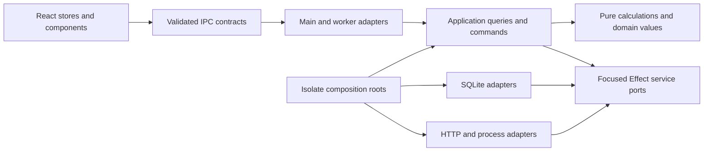

# Effect target architecture and product completion plan

This extends [the September 30 assessment](../research/effect-adoption-assessment-2026-09-30.md) and [issue #148](https://github.com/Pasquale-Favella/watchtower/issues/148). It specifies the target of the authorized Zod replacement and backend restructuring. Implementation starts from local commit `ce81593`, which includes ledger Schema Wave A. Names below describe responsibilities; the execution record distinguishes implemented work from remaining work.

Full Effect adoption is complete when contracts have one Schema authority, application workflows compose ports, each isolate owns its resources, and product operations avoid redundant work. A library substitution alone does not establish those properties.

## Dependency direction

Arrows mean dependency or composition. An adapter implements a port; application code depends on the port interface. The roots select implementations. SQL and process objects do not enter domain calculations or wire payloads.

| Responsibility            | Owns                                                                              | Must not depend on                                              |
| ------------------------- | --------------------------------------------------------------------------------- | --------------------------------------------------------------- |
| Shared contracts          | Encoded IPC inputs/outputs, portable domain shapes and reusable field schemas     | Electron, Node IO, SQL clients, live services, React components |
| Pure calculation          | Pricing precedence, turn/session aggregation, Section calculations and formatting | Repository classes, runtime execution, mutable module config    |
| Application               | Query loading, commands, fallback policies, cancellation and resource use         | Concrete SQLite/client implementations or Electron callbacks    |
| Infrastructure            | SQL, HTTP, files where effectful, process transport, local log forwarding         | React stores or Section presentation                            |
| Composition and transport | Runtime/layer construction, boot, protocol mapping and shutdown                   | Hidden per-workflow dependency construction                     |
| Renderer                  | React state, Promise calls, synchronous Schema decoding and visible errors        | Backend runtime, fibers, ledger access                          |

Apply these boundaries in existing modules first. Moving every file before separating responsibilities makes review harder. After behavior is stable, consolidate application queries, pure ledger calculation, and SQL adapters into explicit directories. Keep established import paths through temporary re-exports only when necessary, and give each re-export a deletion condition.

A gradual module layout can keep roots in `main-runtime.ts` and `worker-runtime.ts`, transport in `db-worker/` and IPC modules, query workflows in a focused `ledger/queries.ts`, pure calculation in `ledger/aggregation.ts`, and SQL/row codecs in `store/`. These paths are proposed destinations, not a required bulk rename. Split current mixed responsibilities before moving them. Internal SQL row codecs should not import wire/renderer adapters; portable domain types and wire contracts stay under `shared/` where both targets actually need them.
A workflow such as GetOverview is a named Effect function consuming services. It does not require its own service tag. A capability such as LedgerQueries or a scoped process factory earns a tag because it has a substitutable implementation or an owned resource.

## Schema authority and decoding policy

[ADR 0034](../adr/0034-effect-schema-contract-authority.md) records the authorized replacement. Distinguish representation and validation ownership:

| Data                         | Authority and owner                                                 | Failure policy                                                                          |
| ---------------------------- | ------------------------------------------------------------------- | --------------------------------------------------------------------------------------- |
| Provider input               | Extraction schema, decoded by extraction adapter                    | Skip the malformed unit, increment the existing tally, retain the remainder of the scan |
| Cache/file content           | Cache codec, decoded by cache adapter                               | Apply the existing invalid-cache/reparse policy explicitly                              |
| SQLite rows and JSON columns | Projection/row codec, decoded by repository                         | Typed decode failure; corruption cannot become a successful empty ledger                |
| Decoded calculation input    | Domain types derived from relevant schemas                          | Already validated; calculation does not repeatedly decode the same values               |
| IPC request/result/event     | Wire schema, decoded at the owning transport/trust boundary         | Preserve operation envelope, rejection policy and renderer tripwire                     |
| Trusted UI-only values       | Plain types or Schema-derived types where a runtime contract exists | No artificial runtime validation for component constructors                             |

A row codec can map snake_case columns and JSON strings to decoded values. It cannot be reused as a wire validator if the wire already contains decoded camelCase fields and arrays. State `Type` and `Encoded` for every transforming contract and identify which representation actually crosses the boundary. Preserve existing Date/structured-clone behavior; do not apply JSON encoding to all channels as a migration shortcut.

Use `Schema.decodeUnknownEffect` where application Effects must preserve typed failures. Use synchronous `Schema.decodeUnknownResult` at pure extraction and renderer boundaries. Its rc.115 implementation returns Schema mismatches as Result failures but can still throw defects or non-schema failures. Transformations must not throw on expected malformed inputs, and the existing renderer fetch/event guards still need to contain unexpected decoder defects. Wire schemas must have no asynchronous decoding or service requirements. Never start a runtime solely to validate a renderer payload.

Share field definitions where representations agree. Derive a narrower projection rather than decoding a wide row and discarding fields. Projection schemas and payload schemas may legitimately differ; they are contracts for different data. Avoid two independent definitions of the same contract or permanent Zod-compatible wrappers around Effect Schema.

The recorded migration rules remain mandatory: finite numbers, explicit coercion, `Schema.Literals`, transformation order, optional/null semantics, mutable arrays where consumers require them, defaults, record intersections, and JSON errors. Verify both acceptance and decoded values. Error paths and labels shown by renderer helpers also require an intentional translation; replacing `.issues[0]` by a full issue dump can expose raw data and change the error experience.

Inventory imports and consumers from the live source. Historical schema counts are a baseline, not an implementation checklist. Work in dependency order: shared scalar shapes and internal contracts, row/projection codecs, payload contracts, then their renderer adapters and remaining UI-only definitions. Convert one contract and all consumers together. The final removal gate includes src, tests, scripts, generated code/configuration and direct package declarations, followed by a lockfile update through the package manager.

### Transition at shared decoding helpers

At the migration baseline, the renderer's generic fetch/event helpers required ZodType. The first migrated wire contract therefore needed a temporary decoder seam before the last Zod contract could disappear. Give the generic helpers an inferred decoder function with a normalized success/failure result. Each call supplies the decoder for its single authoritative contract. An unmigrated contract uses its existing Zod decoder; a migrated contract uses Effect Schema. No contract is defined in both libraries. The final removal is recorded below.

Name the seam's removal condition: after all contracts used by the shared helpers migrate, remove the Zod decoder adapter and make the remaining helper interface Effect Schema-native. Preserve synchronous event handling and visible error labels throughout. This is a temporary interoperability boundary, not a permanent abstraction over two schema libraries.

Wave A and Wave B describe consumers, not mandatory global barriers. Inventory actual runtime and type dependencies. A leaf wire contract can migrate before unrelated internal parser modules once its helper seam and consumers are ready. Contract ownership and dependency order determine the commit boundary. Capture the prior schema verdicts/decoded values before replacing it, so parity can be reviewed without leaving parallel production definitions.

### MCP registration is a separate migration dependency

The installed `@modelcontextprotocol/sdk` high-level registration API takes Zod shapes. `server/zod-compat.d.ts` defines AnySchema as Zod v3 or v4, rather than a generic Standard Schema. At the migration baseline, Watchtower's `ledger-mcp/tools.ts` and `prompts.ts` exposed ZodRawShape, and `server.ts` passed these to registerTool/registerPrompt. Effect Schema could not be substituted by a cast or by changing the shared overview schema alone. The evaluated adapter and its implementation are recorded below.

Before migrating these shared inputs, evaluate an SDK adapter that advertises JSON Schema generated from the authoritative Effect request schemas and decodes tool arguments with Effect. One candidate is the official SDK Server request-handler API using its exported protocol request schemas. Keep official transport, negotiation and error handling under ADR 0020; this is not authorization to write a JSON-RPC implementation. The evaluation must cover tools/list and call, resources, prompts, malformed args, metadata generation, protocol errors and cleanup, with a recorded verdict before implementation. A generated metadata projection is allowed; manually maintaining another validation schema for the same tool is not.

The SDK itself declares Zod and zod-to-json-schema dependencies and a Zod peer dependency. The completion gate is zero Watchtower-owned Zod contracts, imports and direct declaration after consumer conversion, with SDK-owned protocol validation documented at the adapter. Zod may legitimately remain in the dependency lockfile or package tree. Eliminating those transitive packages would require replacing or upgrading the SDK and a separate evaluation of protocol support. Do not label a lingering Watchtower tool schema as a third-party exception.

### MCP adapter evaluation, 2026-10-01

Verdict: use the installed SDK's exported `Server` for this advanced adapter. Its `setRequestHandler` API accepts the SDK's protocol request schemas. The SDK continues to own initialization, version negotiation, framing, request validation, protocol errors and transport shutdown. The six application handlers cover tools/list and call, resources/list and read, and prompts/list and get. No Watchtower JSON-RPC implementation or Effect-to-Zod cast is needed.

The installed `server/index.d.ts` marks `Server` deprecated for ordinary use and explicitly reserves it for advanced use cases. This adapter needs independent argument validation and generated metadata, which the high-level `McpServer` registration cannot provide without Zod tool shapes. Using `McpServer.server` alongside high-level registrations would give both layers ownership of the same handlers; `server/mcp.js` installs them from its private registration maps. Keep one handler owner and confine this SDK dependency to `agents/ledger-mcp/server.ts`.

In Effect rc.115, generate input metadata with `Schema.toStandardJSONSchemaV1(schema)['~standard'].jsonSchema.input({ target: 'draft-2020-12' })`. This projects the contract's Encoded input. Decode tool arguments with the same authoritative Effect schema, then pass decoded values to the tool. The SDK's own protocol schemas remain dependency-owned Zod values. Generated JSON Schema advertises inputs; it is not a separately maintained validator.

Preserve current error categories. The installed high-level handler returns `isError: true` for an unknown tool, invalid tool arguments and ordinary handler failures. Resource and prompt lookup failures remain SDK `InvalidParams` protocol errors. Malformed MCP envelopes and unknown protocol methods remain SDK errors. Verify these distinctions with a real SDK client, including absent arguments, metadata, known and unknown names, each tool's output, and both stdio and stateless Streamable HTTP. Check response/transport shutdown and read-only store ownership; closing a per-request server must not close the process-owned store.

Implementation depends on the renderer decoder transition and the shared scope contract. `overviewScopeSchema` has runtime consumers in `schemas/agents.ts` and `agents/ledger-mcp/tools.ts`. Convert those containing contracts and consumers together. The renderer stores import the scope type and need no refresh changes. Other dashboard payload schemas can migrate in later groups. `ledger://schema` is descriptive documentation; any generated tool argument section should reuse the advertised metadata rather than copy its validation rules.

This evaluation inspected the installed SDK and Effect sources and current consumers. It did not run a protocol experiment. The adapter is accepted for implementation; its behavior and cleanup remain acceptance gates.

## Eliminate work at its owner

There are several different costs. Track them separately:

- Runtime transitions caused by nested `runSync` or Promise adapters.
- SQLite statements and total rows/columns returned.
- Repeated JSON decoding and validation of those rows.
- Repeated reconstruction and pricing of the same facts.
- IPC requests triggered by shell and Section refresh.
- Re-validation at distinct trust boundaries, which must remain even when internal duplicates are removed.

Neither local Effect Cache nor RequestResolver removes a cross-process request automatically. A layer graph also does not make SQL statements parallel or an individual synchronous query interruptible.

| Operation and source evidence                       | Redundant work today                                                              | Target                                                                                                                                                  |
| --------------------------------------------------- | --------------------------------------------------------------------------------- | ------------------------------------------------------------------------------------------------------------------------------------------------------- |
| `buildAnalyticalViewsFromLedger`, `views.ts:84`     | Builds summaries, then the dashboard builds them again                            | Load one request snapshot; calculate both from it                                                                                                       |
| `buildOverviewFromLedger`, `overview.ts:725`        | Builds lifetime and scoped summaries independently                                | Reuse one snapshot initially; later obtain dataStart through a small semantically equivalent metadata query and scoped facts                            |
| `buildProjectRowsCore`, `views.ts:142`              | Calls `getSessions()` inside the source loop                                      | Read sessions and sources once, index by source/session, then join in memory or SQL                                                                     |
| `buildSessionSummaries`, `aggregate.ts:509`         | Reads sources in queryScope, then again for provenance                            | Include provenance in the loaded snapshot                                                                                                               |
| `getSessionDetailFromLedger`, `views.ts:265`        | Reconstructs the whole lifetime ledger to find one session                        | Read the facts needed for that session under the existing identity/selection semantics                                                                  |
| `searchSessionsFromLedger`, `views.ts:99`           | Reconstructs all sessions to search messages and bash commands                    | Purpose-specific search reads, bounded results and the existing matching/order policy                                                                   |
| `applyChange`, renderer `scan-store.ts:77`          | Fetches full analytics for provider names before notifying all initialized stores | Reduce backend analytics work; evaluate a small shell metadata query through an explicit additive contract. Preserve the existing store implementation. |
| `scopedDataSlice.load`, renderer `data-store.ts:40` | Same-scope requests all pass the scope-only response guard                        | Assess actual IPC ordering and record any remaining limitation. Preserve the existing store implementation.                                             |

The project source loop is a source-confirmed N+1 read pattern, not a measured duration. It was not part of the original `store:views` benchmark. Eliminating it has its own statement-count acceptance criterion and needs no general cache.

The same-scope response race is a source-level finding. Scope identity distinguishes different filters but not two refreshes for the same filter. The owner rejected added renderer coordination. Assess whether actual worker dispatch can return these responses out of order before specifying further work; the restored stores do not establish newest-request ownership.

## Query composition and consistent pricing

Load a request snapshot containing the projected facts, source/session provenance, aliases, price overrides, pricing catalogue snapshot and a captured query time. Pure calculations consume it explicitly. Carry compound source/session/turn identity internally. Preserve existing external session ids and selection behavior unless a separate contract change is specified.

Obtain a coherent set of database facts and config on the owning thread. If multiple SELECTs must represent one read unit, execute the complete unit under the existing synchronous boundary and the required SQLite transaction policy. Do not introduce Promise waits or Effect scheduler yields while that transaction is open. Capture pricing state and query time for the same application operation, then release database ownership before expensive calculation or export file IO.

Start with request-level sharing. Its lifetime ends with the operation and it needs no cache invalidation. Summaries and dashboard calculation must accept loaded data rather than call the repository again. Models and other Sections use the same pure price resolver with an explicit config/catalogue snapshot. Preserve ADR 0033's recorded-cost, alias, override, reasoning, tier and fallback rules.

Push down provider and time filtering only after defining the semantic query unit. The current scope includes a complete turn by its first assistant call timestamp. Filtering individual calls can change totals. Search/detail retain prompt text when necessary; summary projections omit it only after consumers stop requiring it. SQL grouping can reduce rows decoded, even though merely replacing the existing JS calculation has a small measured ceiling.

Do not load the full ledger and then wrap it in a Stream to claim bounded memory. Bounded reads require SQL predicates, projections, pagination or cursor batches. Cursor consumption must release every statement/resource and preserve export order and per-operation consistency.

## Cache and refresh policy

ADR 0008 currently excludes per-query caching. Request-level reuse is the first implementation target. A cache shared across requests is a proposed extension, requiring an explicit ADR amendment and evidence that projection and request reuse are insufficient.

If adopted, its key includes normalized scope, relevant data/config/pricing revision and any query-time input such as a date boundary. Its memory budget accounts for returned rows and summaries, not only entry count. Never retain a second full copy of the lifetime ledger to hide repeated reads. Cache only deliberate reusable results, evict them under a bounded policy, and avoid retaining rejected or cancelled fills.

Advance data/config revisions after committed relevant writes, including per-file ingest if queries can observe partial scans, clear/delete, aliases and overrides. Preserve atomic ordering between the commit, revision publication and notifications. Currency-dependent output needs its own freshness input or conversion after a cached USD calculation. A pricing refresh and passage across midnight can invalidate results without a new ledger row.

A sidecar has a separate connection and cannot rely on a worker-local revision. Keep its reuse request-local unless there is a database-visible revision/freshness protocol. No new scan-time materialized derived costs are introduced; ADR 0002's raw-fact ledger and instant config repaint remain requirements.

Owner correction during implementation: preserve the existing `data-store.ts` and `scan-store.ts` implementations. Request counters, Promise ownership and refresh coordination variables in these stores were rejected and restored. F35/F36 remain source findings to assess against actual IPC ordering; no added renderer coordination is scheduled. Continue reducing backend reads and consider the separately specified shell metadata query. Schema conversion may update contract imports without adding refresh machinery. Changing eager refresh policy still requires an ADR 0011 update.

## Effect patterns selected for a reason

| Pattern                                       | Apply it to                                               | Constraint                                                                                          |
| --------------------------------------------- | --------------------------------------------------------- | --------------------------------------------------------------------------------------------------- |
| `Context.Service` and Layer construction      | Repository ports, pricing state, IO and process factories | Dependencies enter through interfaces or layer requirements; no AppServices mega-interface          |
| `ManagedRuntime`                              | Main, worker and read-only MCP roots                      | One application-owned graph per isolate; adapters execute there                                     |
| `Effect.fn` and `fnUntraced`                  | Application spans and cheap helpers respectively          | Trace query/transaction operations, rather than each row                                            |
| `Schema.TaggedError`, Exit and Cause handling | Expected operational failures and boundary mapping        | Keep typed failures, interruption and defects distinct; no empty-success corruption fallback        |
| Scope and `acquireRelease`                    | Connections, process handles and owned subscriptions      | Finalizers must work while an external Promise/iterator is pending; use the independent stop handle |
| Fibers and owned handles                      | Scan, cadence, probes and Coach pump                      | Cancellation stops underlying work and drains it before releasing resources                         |
| Deferred or a bounded queue                   | Actual single-flight/coalescing or incremental delivery   | Specify failure/reset/latest-request semantics before choosing a primitive                          |
| Schedule and Clock                            | Existing retry/cadence and captured operation time        | Retry only allowed transient outcomes; do not retry an aborted write or scan                        |
| `Effect.all` with bounded concurrency         | Independent network/process work                          | No fan-out over one synchronous SQLite writer merely to use concurrency                             |
| Stream                                        | Incremental scan/export/Coach IO with real backpressure   | Bounded input and cleanup policy required; avoid wrapping already materialized arrays               |
| Cache or RequestResolver                      | Measured repeated/batched demand                          | Defer until freshness, key, size and ownership contracts exist                                      |
| Logger and Tracer over an injected sink       | Local operation/counter observation in each isolate       | Forward worker records to main; keep the allowlist and no exporter policy                           |

RcMap, generated SqlModel and unstable RPC remain outside this plan under their recorded verdicts. Effect Schema authorization does not reverse those verdicts. Test support must match the pinned rc.115 APIs.

## Structural and product gates

When implementing these slices, verify properties that users depend on. The checks below are future acceptance work; none was run for this document.

| Gate              | Observable acceptance                                                                                                                                                                 |
| ----------------- | ------------------------------------------------------------------------------------------------------------------------------------------------------------------------------------- |
| Query work        | Analytics has one summary load per request; project session reads do not grow with source count; detail reads avoid unrelated session facts                                           |
| Runtime ownership | One worker writer connection and runtime; MCP read-only connection; initialization and teardown counted exactly once                                                                  |
| Contract parity   | Valid/invalid verdict and decoded output parity, deliberate JSON error changes, renderer error states and broadcast dropping preserved                                                |
| Freshness         | Aliases/overrides repaint without rescan; pricing refresh and date rollover produce current derived results; assess actual IPC response ordering while preserving the original stores |
| Cancellation      | Stuck next/return and delayed parse callbacks cannot retain registries, emit late events or write after connection release                                                            |
| Performance       | Rerun comparable 1k/50k/500k operations; record median/range, statements, rows, bytes decoded, heap/RSS and IPC payload size                                                          |
| Structure         | Pure calculation imports no repository/runtime/live IO; application imports ports; live wiring stays at roots; tests typecheck separately                                             |
| Delivery          | Keep rollback, warm-cache backfill, boot/respawn, offline fallbacks, full-history export and existing packaging targets                                                               |

There is no measured post-migration speedup yet. Sub-second reads remain the product objective in ADR 0002, but no new arbitrary universal latency or memory threshold is asserted. Size budgets from before/after measurements and representative heavy ledgers. Include projects, detail, search and a complete refresh cycle in the next measurement, since the original harness did not cover every expensive product path.

## Implementation sequence

1. Settle the active ledger Schema/projection work and measure its result. F25/F26 and test typechecking may proceed independently.
2. Introduce explicit query input and request-level reuse. Remove the project N+1 reads, duplicate analytics reconstruction and redundant provenance reads before adding caching. Preserve the original renderer stores and assess actual IPC ordering separately.
3. Move SQL acquisition, migrations and ledger ports under the worker root. Carry typed errors through application queries and map them at transport. Install the worker observation forwarding sink during this work.
4. Separate the worker supervisor, query/command workflows, pure calculation and protocol dispatch. Retire LedgerStore across FX, exports, MCP, scripts and tests. Consolidate directories only after responsibilities are separated.
5. Complete Schema migration by contract dependency groups, with synchronized consumer changes and renderer tripwire adaptation. The contracts can advance independently of directory moves once their owning files settle. Remove Zod after the final direct consumer.
6. Add purpose-specific summary/detail/search reads and measure SQL reduction. Decide on bounded cross-request reuse from those measurements and amend ADR 0008 if adopting it. Complete scoped main/Coach ownership under the existing cancellation plan.
7. Close the product gates and reconcile the tracker/PR with the delivered scope. Issue #148 remains a programme tracker until its remaining acceptance criteria are met.

## Execution record

The owner authorized implementation with the orchestrate-implement skill and GPT-6 Luna subagents at high effort. The first wave starts at `ce81593`. The entries below distinguish committed slices from work under review. Full product gates remain pending.

| Slice                       | Current evidence                                                                                                                                                                                                                                               | Remaining work                                                                                                                                                |
| --------------------------- | -------------------------------------------------------------------------------------------------------------------------------------------------------------------------------------------------------------------------------------------------------------- | ------------------------------------------------------------------------------------------------------------------------------------------------------------- |
| Request reuse, F29/F33      | Committed in `309b3d7` after Standards and Spec review. One request snapshot, explicit aggregation inputs and constant project reads. `0cd0ef7` adds an explicit catalogue shared with Models repricing and audit.                                             | Direct-port application loader, facade removal, query diagnostic ownership, captured query time and comparable performance measurement.                       |
| Renderer freshness, F35/F36 | Owner rejected both local coordination designs. Original production stores restored; the two original focused files pass, 34 tests.                                                                                                                            | Assess actual IPC ordering and reduce backend hydration work; retain the existing stores and refresh policy.                                                  |
| Virtual-time deadline, F26  | Deadline in `9133ad8`; registered-sleep driver and true retry ceiling in `6170cc2`, lint correction in `e32b771`. Both reviews passed. The previously failing pricing timeout now passes in the full suite.                                                    | Maintain the deadline and clock checks as later workflows migrate.                                                                                            |
| Coach cancellation, F25/F30 | Committed in `650ddf7` after both reviews and simplification. Controlled run/probe handles and bounded production cleanup; 114 focused tests passed.                                                                                                           | Legacy injected runtimes without controlled inspection still require their inspect Promise to settle. Remove that compatibility branch after callers migrate. |
| Test typechecking, F22      | Committed in `bec1688` after Standards and Spec review. Dedicated test config and CI command; stale mocks and fixtures repaired without suppressions. Strict test typecheck passes.                                                                            | Full-suite verification and maintenance as later contract groups migrate.                                                                                     |
| Worker observations, F28    | `7458c5f` adds the sanitized forwarding sink. `41d5ea5` consolidates SQL under the observed worker runtime; `1ac883d` retains repository operation spans and suppresses per-statement SQL records. Main remains the only file writer.                          | Maintain operation-level observations as direct-port workflows replace the facade.                                                                            |
| Internal Schema group, F34  | Committed in `21826d2`. Pipeline, provider extraction, cache and port contracts use Effect Schema; the extraction helper and internal scan delta consume them. Both reviews passed after expanding frozen-contract parity and v5/v6 history-adoption coverage. | Migrate remaining wire contracts and consumers, then remove the temporary Zod parity references and direct dependency.                                        |
| Coach test ownership        | Committed in `42f0514` after both reviews; 63 focused tests passed. Fixture cleanup resets only its own runners instead of deleting every Coach workspace in OS temp.                                                                                          | Maintain resource ownership in future test fixtures.                                                                                                          |

Further waves retain the complete implementation sequence above. Current focused passes do not establish full migration, integration or performance completion. The later execution records supersede the table's initial direct-port and initialization status for dashboard/analytics and worker boot.

First-wave integration also passed production and strict test typechecks, lint with zero errors, the production build and all four Electron end-to-end tests. That run's pricing clock-registration failure prevented treating the wave as fully green. Its format check exposed three timeout-test files. Those results preceded the internal schema and worker observation changes; the next increment repaired the clock registration and formatting.

Integration on 2026-10-01 passed production and strict test typechecks, lint with zero errors, format check, build, all 103 unit-test files with 1,810 passed and 2 skipped, and all four Electron end-to-end tests. An earlier run exposed a Coach workspace test failure; the two test files' blanket temp cleanup allowed cross-suite deletion. The ownership fix above passed the subsequent full suite. These gates cover the integrated schema, clock and worker forwarding changes. They establish a verified migration increment, not completion of the remaining architecture, contract, performance or packaging gates.

The cache loader now derives a disk compatibility codec from its strict shared schemas. It preserves formerly unchecked flag semantics: `durable` uses truthiness, while `complete` and `prEvidenceV1` require `true`; absent flags remain absent. Shared schemas still reject malformed flags. Unknown extension keys strip after an audit found no current consumer; valid cached facts survive normalization. Retire this codec only with a documented cache version or support cutoff, after older files have been rewritten or migrated. A valid active cache remains authoritative; prior-version orphan adoption runs only when the active cache is absent or invalid.

### Renderer decoding and scan ownership increment, 2026-10-01

- `67de4b9` introduces the synchronous renderer decoder interface and converts cadence contracts and their get/set consumers to Effect Schema. Frozen Zod fixtures compare both verdicts and decoded values, including stripping, finite numbers, missing/undefined/null fields and arbitrary strings. The temporary Zod adapters disappear after their last contract consumers migrate. Neither renderer store changes; both still match `ce81593`, with no added `let` variables or refresh coordination.
- `246a259` acquires parser work lazily and drains its actual Promise and callbacks before releasing the per-scan owner or SQLite. Port-in checks abort again after URL lookup. F31 remains partial: the parser has no independent stop handle, and a never-settling Promise can still hold abort or close indefinitely. The next cancellation slice must stop underlying work and drain it.
- `175072a` corrects the asynchronous spawn failure exposed by Linux CI at `7afb589`. Command startup now waits for Node's spawn result. Error listeners are installed with child acquisition and retained until close, including interruption during startup. The real invalid-cwd test exercises typed failure on every platform; a controlled delayed-error test checks cancellation and listener cleanup. The POSIX missing-executable case remains enabled on POSIX.
- `3ec87a5` replaces the cancellation primitive test's 80 ms event-rate assumption with a Deferred event barrier. The first full integration run failed after receiving one event; the corrected test requires exactly two captured events and one cleanup.

Production and strict test typechecks, lint with zero errors, format check and build passed for the code increment. The full unit suite passed all 105 files, with 1,851 tests passed and 2 skipped. Standards and Spec reviews passed after repairing cadence parity and the interrupted-startup listener gap. The simplifier removed an unnecessary test teardown catch so close failures surface.

All four Electron checks against the new build passed on Windows. GitHub Linux unit/lint and Linux/Windows Electron checks passed at `dd20db7`, verifying the POSIX command startup correction after publication. Full migration, bounded parser cancellation, one worker SQL/runtime owner, facade retirement, remaining contracts, purpose-specific reads, comparable performance and packaging gates remain open.

### Request pricing and wire contract increment, 2026-10-01

- `634d832` converts currency, update and export contracts and their renderer fetch/broadcast consumers to Effect Schema. Frozen prior contracts compare verdicts and strict decoded outputs, including stripping, optional undefined fields, required nullable fields and finite-number boundaries. The focused API, subscription and parity group passed 22 tests.
- `0cd0ef7` extracts pricing resolution, tier selection and arithmetic into a module receiving a captured catalogue. The request loader captures once; aggregation, Models repricing and audit share that capture. Live aliases, overrides and pricing refresh invalidate the memoized catalogue, while previously captured input remains stable. Schema types remain authoritative, and parser/provider positional adapters retain their existing interface.
- Review repaired inherited-object alias lookup and preserved arithmetic summation order. The pure result reports an unpriced alias target; a temporary outer adapter preserves opt-in, sanitized, deduplicated warnings. Regression tests prove that pure calculation emits no log and the adapter emits one warning. Retire this adapter when application workflows own diagnostics. The existing Models/aggregation parity suite also passed.

Both original renderer stores remain identical to `ce81593`. The added contract consumers use the existing synchronous decoder and React/Promise model.

Production and strict test typechecks, lint with zero errors, format check and build passed. The full unit suite passed all 107 files, with 1,867 tests passed and 2 skipped. All four Electron end-to-end tests against the new build passed on Windows in 5.3 minutes. Standards and Spec reviews passed after the alias and warning corrections. The positional pure/provider cost interface remains a nonblocking simplification follow-up when scan-boundary inputs migrate.

F29 remains partial: the query loader uses the synchronous LedgerStore facade and query diagnostics still enter through the legacy outer module. Facade retirement, typed application query failures, parser stop, remaining contracts and MCP adapter, purpose-specific queries, comparable measurement and packaging remain acceptance work. The worker ownership increment below establishes one SQL/runtime owner. No speedup is claimed.

### Worker SQL ownership and direct FX increment, 2026-10-01

- `86215fd` composes the canonical FxRates layer over LedgerConfig. Storage and Schema failures remain in the error channel; only HTTP failures use the cached or USD fallback. One background handler logs expected failures using the existing allowlisted code field. Cadence comparison reads through the FX port. A real malformed-cache test requires one error record, zero fetches and no successful currency event.
- `41d5ea5` gives production worker boot one ManagedRuntime containing the SQLite client and ledger ports. The temporary LedgerStore facade borrows that same runtime and does not acquire or dispose a second connection. Its migration initialization runs synchronously before the owner factory returns and before entry publishes ready. Driver configuration and finalization stay with the pinned SQLite layer.
- Tests count the canonical runtime factory and actual DatabaseSync.close calls. They cover successful lifetime, future-version rejection and graph construction failure after acquisition. A separate test imports the real worker entry with its transport and context construction substituted, then verifies context-construction failure closes the actual driver once, preserves the original error, and registers no request handler or ready event.
- Failed graph cleanup runs disposal directly at the root so it can execute after the graph fails to build. Normal shutdown drains background work and actual parser/callback completion before disposing that root. Repository spans use the worker observation sink. A canonical FX dispatch test proves a substituted LedgerConfig reaches currency writes without replacing FxRates itself.
- `1ac883d` omits the driver's per-statement `sql.execute` log records while ending their spans normally. Enclosing application and repository operations retain timing and sanitized failure codes. This is one exact-name condition, with no additional state, writer or quota. The focused tracer/worker group passed 13 tests.

Standards, Spec and scoped simplifier review passed after the cleanup, typed FX, tracing and comment corrections. The combined worker/FX focused group passed 167 tests across 11 files; the entry failure regression passed separately. The tracer/worker group passed 13 tests. At `1ac883d`, production and strict test typechecks, lint with zero errors and build passed. The full suite passed all 110 files, with 1,878 tests passed and 2 skipped. All four Electron checks against the new build passed on Windows in 5.3 minutes.

The first Electron run could not find the boot record after onboarding. An isolated startup check found that record before the initial scan. The corrected test checks boot at that lifecycle point, then still checks onboarding, the forced IPC failure, parseable records and zero renderer errors. Source inspection found one forwarded record per SQL statement; operation-level tracing now omits those records. The passing rerun does not establish a measured performance change or prove trace volume caused the earlier failure.

Both renderer stores remain identical to ce81593. The worker ownership result is separate from full facade retirement: migration definitions and compatibility initialization still live in LedgerStore, and standalone callers still create their own database runtime. The standalone FX runner adapter converts synchronous failures into defects and remains only until its callers compose the canonical config port. Plain currency response reads, direct-port application query loading, typed protocol mapping, bounded parser stop, remaining contracts and MCP adapter, purpose-specific queries, comparable measurement and packaging remain open. No speedup is claimed.

### View contracts, root initialization and application queries, 2026-10-01

- `fc0315e` converts models/views contracts and all affected renderer/producer consumers to Effect Schema. Model aliases and price overrides reuse the ledger schemas. UI-only renderer values become plain TypeScript types. The 21 frozen-contract parity checks compare strict decoded outputs, optional/undefined/null distinctions, stripping, NaN and both infinities, and mutable consumer fields/arrays.
- `67cb812` extracts migration definitions and initialization from LedgerStore. The worker root creates the parent directory, acquires its single SQL graph and runs initialization before constructing the borrowed facade and publishing ready. Standalone writable compatibility callers use the same initializer, while read-only callers skip it. Actual-driver tests verify one initialization, one close, nested missing parent directories and cleanup after standalone constructor rejection.
- `9fe7a15` adds a consistent snapshot query to LedgerQueries and the canonical Effect loader. Six facts/config SELECTs materialize inside one transaction; row decoding runs after commit. Dashboard and analytics application queries use this loader and return typed SQL/Schema failures. Output validation remains at the application boundary. Eight worker query checks require one snapshot call, forbid facade bulk reads, compare seeded payloads, verify config freshness without a scan and preserve expected failures. Snapshot tests separately cover real SQL failure and schema corruption after a successful transaction.

Standards and Spec reviews found no blockers. Follow-ups removed a generic mutable-schema helper and casts, avoided redundant array copies, expanded strict parity and freshness checks, and preserved directory creation before database acquisition. Production Node/web and strict test typechecks passed. Lint passed with zero errors and 1,168 warnings under the existing policy. Full format check and build passed at source `9fe7a15`. The full unit suite passed all 114 files, with 1,913 tests passed and 2 skipped. All four Electron checks passed against the rebuilt application on Windows in 5.2 minutes.

F29/F32 remain partial. Other loaders still use LedgerStore, and the static module graph still reaches mixed legacy calculation/diagnostic modules. Typed query failures reach dispatch, but bounded protocol error mapping remains open. Scoped queries still need captured time and scan-boundary catalogue inputs. Six SELECTs are unchanged and transaction control adds statements; this increment makes no SQL reduction or speedup claim. Full contract migration and MCP compatibility, facade retirement, bounded parser stop, purpose-specific reads, comparable measurement and packaging remain acceptance work. Both original renderer stores still match `ce81593` exactly.

GitHub CI at published head `b2b62a3` passed [Linux typechecks and unit tests](https://github.com/Pasquale-Favella/watchtower/actions/runs/36888115353/job/110456536416), [lint and formatting](https://github.com/Pasquale-Favella/watchtower/actions/runs/36888115353/job/110456536026), [Electron on Linux](https://github.com/Pasquale-Favella/watchtower/actions/runs/36888115373/job/110456537699) and [Electron on Windows](https://github.com/Pasquale-Favella/watchtower/actions/runs/36888115373/job/110456537380). Both workflows report success for that exact head.

### Scan contracts, pure queries and worker recovery, 2026-10-02

- `e4a34df` converts scan, IPC and ledger-MCP status/startup contracts with their main, repository and renderer consumers. Frozen-contract parity covers decoded values, trimming, finite numbers, valid Date objects, absent/undefined/null fields and extension stripping. Storage tests retain the corrupt-startup-mode fallback.
- `b7f2b38` separates pure view and aggregation calculations, pricing/name resolution, proxy matching, parser metadata helpers and session-row mapping. Dashboard and analytics capture pricing and proxy configuration once and load through focused ledger ports without importing the SQL implementation. Unpriced-model reporting uses a replaceable application port provided at the worker root. Import-graph tests cover the pure and application boundaries without an infrastructure exception.
- `8b1859f` adds a two-second host deadline for cooperative scan abort. Expiry waits for actual worker termination before creating a replacement; requests wait for bounded replacement readiness. Identity guards reject old events, failed recovery rejects waiting requests, and shutdown shares native termination. Recovery settles its shared gate on success, typed failure, defect and interruption. Fifty-five focused client tests passed, including a real worker whose delayed callback must not write or publish progress. Forced termination does not prove cooperative parser cleanup or execution of Effect finalizers.
- `472e993` fixes SQL measurement provenance with AST extraction from the exact repository method and its constant aliases. Fourteen tests cover the real projections and rejection of dynamic, ambiguous or unrelated SQL. Measurements hash the extracted modules and harness sources, record source/script dirtiness and use a fresh temporary ledger directory. The harness still measures compatibility builders; direct application queries and complete refresh/detail/search measurements remain open.
- `3215238` extends the narrow-read source audit to the extracted calculation modules and retains its exact field-owner inventory and wire assertions. All eleven focused checks passed.

Standards and Spec reviews found no blockers. The first full run passed 116 files but failed the stale source audit and six real-process cases. The audit was corrected; the unchanged command-runner and yield cases passed in isolation. The complete rerun used one worker with unchanged assertions and timeouts and passed all 119 files, with 1,966 tests passed and two skipped, in 176.30 seconds. Production Node/web and strict test typechecks passed. Lint passed with zero errors and 1,191 warnings under the existing policy. Full format check and production build passed. All four Electron checks passed against the rebuilt application on Windows in 5.2 minutes. These gates verify `3215238`; they do not establish programme completion.

Fourteen of 23 baseline contract modules now use Effect Schema throughout, 60.9%. Including the UI-only module converted to plain TypeScript, Zod removal covers 15/23 modules, 65.2%. These counts are separate from import coverage and programme completion. Both original renderer stores remain byte-identical to `ce81593`.

The corrected harness completed a smoke run at `3215238` for compatibility dashboard and analytics builders. It generated 1,008 calls for the requested 1k size and used five measured runs plus one warm-up. This validates harness execution; it is not a comparable scaled measurement or evidence for the canonical Effect query path.

Remaining work includes the other application queries and facade callers, captured query time and scan-boundary pricing inputs, cooperative parser stop, typed protocol mapping, main/Coach ownership, remaining contracts and the accepted MCP adapter, purpose-specific reads, comparable 1k/50k/500k measurements and packaging gates. Six snapshot SELECTs remain. No SQL reduction or speedup is claimed for this increment.

GitHub CI for published head `d7282ed` passed [Linux typechecks and unit tests](https://github.com/Pasquale-Favella/watchtower/actions/runs/36986519631/job/110772692936), [lint and formatting](https://github.com/Pasquale-Favella/watchtower/actions/runs/36986519631/job/110772692605), [Electron on Linux](https://github.com/Pasquale-Favella/watchtower/actions/runs/36986519589/job/110772693382) and [Electron on Windows](https://github.com/Pasquale-Favella/watchtower/actions/runs/36986519589/job/110772693185). These checks verify that preceding head.

### Section contracts and native ordering evidence, 2026-10-02

- `b2a7ed8` migrates Spend, Compare, Optimize and Yield contracts, their producer validation and renderer fetch decoding together.
- `1d93ae4` migrates Skills and Pull Requests contracts with their producers, Skills input guards and renderer fetches. Native defaults produce required writable threshold fields while accepting absent and explicit undefined inputs. Safe-integer and lower-bound rules match the former contract. Frozen parity checks retain strict decoded values, nested stripping, finite numbers, null/optional distinctions and union branches. Renderer API tests preserve channel labels and request arguments.
- `4896421` decodes the internal resume cursor with Effect Schema, including JSON parsing. Tests preserve instance binding, malformed and empty rejection, extension stripping, Unicode and untrimmed session values.
- `d68fda9` records controlled native read ordering with a real worker, SQLite root, worker context and dashboard application query. A fixture-only Deferred holds delivery after the snapshot transaction. A price write commits and emits `config:changed`; an identical post-change client read reuses the old Promise without issuing a new worker request. The old response arrives after the event with its earlier cost. A subsequent query observes the new cost. This proves stale coalescing under the test barrier. Ordinary synchronous-adapter overlap, full Electron relay ordering and an older view overwriting a newer completed view remain unproven. No production ordering change is included.

Standards and Spec reviews found no blockers before and after simplification. The simplifier removed catch-all parity bookkeeping, used native finite/default schemas, added nested and malformed parity cases and fixed a widened test fixture type. Its seven-file focused run passed 122 tests. Production Node/web and strict test typechecks passed. Lint passed with zero errors and 1,183 warnings under the existing policy. Full format check and production build passed. The complete unit suite used one worker and unchanged timeouts, passing all 122 files with 2,024 tests passed and two skipped in 208.46 seconds. All four Electron checks passed against the rebuilt application on Windows in five minutes. These checks cover source snapshot `d68fda9`.

Effect Schema conversion now covers 20/23 baseline contract modules, 87.0%. Including the UI-only plain TypeScript module, Zod removal covers 21/23, 91.3%. Overview and agents contracts, MCP registration, temporary decoder adapters, frozen references and the direct dependency remain for the final removal gate. All eight view builders import Effect Schema, but that import coverage does not establish pure calculation or application migration. Both renderer stores remain byte-identical to `ce81593`.

The wider programme remains open, including other application queries and facade retirement, captured time and scan pricing inputs, cooperative parser stop, typed transport mapping, main/Coach ownership, purpose-specific reads, comparable scaled measurements and packaging. No performance improvement is claimed.

GitHub CI at `236a291` passed [Linux typechecks and unit tests](https://github.com/Pasquale-Favella/watchtower/actions/runs/36990704317/job/110785989496), [lint and formatting](https://github.com/Pasquale-Favella/watchtower/actions/runs/36990704317/job/110785989331), [Electron on Linux](https://github.com/Pasquale-Favella/watchtower/actions/runs/36990704339/job/110785990215) and [Electron on Windows](https://github.com/Pasquale-Favella/watchtower/actions/runs/36990704339/job/110785990395). Both workflows report success for that exact head.

### Final owned schema removal and worker failure mapping, 2026-10-02

- `6469b99` converts the overview and agents contracts and their producer, Coach request/event and renderer consumers. The renderer fetch/event helpers now accept native Effect Schema decoders directly. The temporary generic decoder interface and Zod adapters are removed. Synchronous Result decoding retains visible labels and paths, and unexpected decoder defects remain contained without logging payloads.
- The same commit replaces MCP high-level registration with the evaluated official SDK Server adapter. Six handlers cover tools, resources and prompts; the SDK owns protocol validation, negotiation, framing and transport errors. Tool arguments decode against native Effect contracts and advertise generated JSON Schema. The JSON scope projection derives exact optional keys from the shared fields, avoiding nullable metadata for in-process undefined values. Absent arguments retain the lifetime default; invalid arguments return an error tool result. Real SDK clients exercise isolated stdio streams and stateless loopback HTTP. Each HTTP request closes its server/transport while retaining the borrowed process-owned ledger. The packaged Windows child check is recorded below. MCP still uses the compatibility facade.
- `953e820` maps worker request and initialization failures to bounded protocol text. Typed SQL, row Schema and unsupported-version failures have static messages; known validation messages use a finite allowlist. Tests exercise real runner rejections and an actual bundled worker with malformed stored data or a missing table. No SQL, row values or filesystem paths enter the response. This closes the worker mapping slice only. Main/Coach mappings and defect distinctions lost at remaining Promise boundaries still require work.
- `43d5b90` removes Watchtower-owned Zod imports and its direct package declaration. Parity tests now use explicit recorded acceptance and decoded outputs, including all 324 ledger cases; the four tracked frozen Zod fixtures are deleted. A source AST guard checks owned imports/re-exports, literal dynamic imports and requires, plus manifest and root lock declarations. The SDK's transitive Zod remains legitimate protocol infrastructure.
- `5b4233b` synchronizes the lockfile through the package manager. It also removes stale Pino root declarations and 24 retired dependency entries, and records four bundled optional Tailwind WASI entries. Existing package versions are unchanged.

Standards review found no blockers. Spec review initially rejected the retained generic renderer decoder interface; converting it to native Schema resolved that blocker. Scoped simplification removed a one-use alias and reused the scoped MCP input schema. The final protected-store comparison is empty against `ce81593`; request identities, coalescing and added mutable coordination remain excluded from these stores.

Production Node/web and strict test typechecks passed. Lint passed with zero errors and 1,187 warnings under the existing policy. Full formatting and production build passed. The complete unit suite used one worker and unchanged timeouts/assertions, passing all 125 files with 2,052 tests passed and two skipped in 927.22 seconds. These source checks cover `43d5b90`; `5b4233b` only synchronizes dependency metadata. The initial Electron run overlapped the unit suite and timed out in the command palette check, with three checks passing. The isolated rerun passed all four checks in 4.3 minutes against the same build, without timeout, assertion or production changes. The passing retry does not establish the cause of the first timeout.

Windows x64 directory packaging passed with `npx electron-builder --win --dir --publish never`. A temporary smoke script launched the actual packaged executable with an isolated profile, completed its real boot scan/onboarding, navigated Models and Overview, and checked zero renderer errors. An official SDK client launched the actual packaged stdio MCP child from `app.asar` under Electron's Node mode and exercised all six tools, advertised metadata, invalid/unknown tool errors, all three resources and the prompt. The client/child and app closed before the temporary profile was removed. The first temporary gate incorrectly treated the Markdown scope resource as JSON; correcting that assertion to the existing contract made the rerun pass without production changes. Installer creation, macOS/Linux packaged execution and complete performance acceptance remain separate gates.

Native Effect Schema conversion covers 22/23 baseline contract modules, 95.7%. Including the UI-only plain TypeScript module, owned Zod removal covers 23/23, 100%. The wider programme remains open: remaining application queries and facade callers, captured query time and scan pricing inputs, cooperative parser completion, main/Coach ownership and failure mapping, purpose-specific reads, comparable scaled measurements and packaging acceptance. No SQL reduction or speedup is claimed.

### CI lockfile correction, 2026-10-02

All four jobs at `ae83bce` failed during `npm ci`, before lint, typechecks, unit tests or Electron could run. The missing entries were dependencies of the optional Tailwind WASI bundle. CI uses Node 22.23.3 and npm 10.9.9; local synchronization used Node 24.13.0 and npm 11.6.2.

Regenerating with CI's npm 10.9.9 adds the bundled `@emnapi/core` and `@emnapi/runtime` entries and normalizes peer metadata. No existing package versions or other existing package fields change. An isolated directory with only the manifest and repaired lockfile passes npm 10.9.9's clean-install dry run. This validates the dependency graph without replacing the workspace's installed packages; the next exact-head CI run must establish actual clean installation and the platform checks. The production/test source remains `43d5b90`, and both protected stores remain unchanged.

The subsequent GitHub CI run at `4451334` passed actual clean installation and all four jobs: [Linux typechecks and full unit tests](https://github.com/Pasquale-Favella/watchtower/actions/runs/37010950386/job/110850263343), [lint and formatting](https://github.com/Pasquale-Favella/watchtower/actions/runs/37010950386/job/110850263547), [Electron on Linux](https://github.com/Pasquale-Favella/watchtower/actions/runs/37010950377/job/110850264116) and [Electron on Windows](https://github.com/Pasquale-Favella/watchtower/actions/runs/37010950377/job/110850263369). Both workflow conclusions and all four individual jobs report success for that exact head.

### Scoped query ownership, 2026-10-02

Production and test source is `0f823d3`, following baseline `4451334`.

- `5316ec8` retains raw alias and override rows already read by the canonical snapshot transaction. Models uses these rows without separate config reads. The six snapshot SELECTs remain unchanged.
- `c5b8a01` moves free-model coverage and unpriced-row calculation into pure pricing helpers receiving an explicit catalogue and local savings map. Overview captures the local map once per request. The synchronous parser lookup uses the existing map directly, preserving exact raw-key and non-string rejection behavior without a per-call copy.
- `bc69a52` extracts local calendar scope helpers. `863892f`, `d097ba3` and `9f5d6ed` add named Sessions, Models and Overview application Effects over LedgerQueries and PricingDiagnostics. Each captures the Clock once before loading one snapshot. Pure calculations receive explicit time and pricing inputs. Compatibility builders retain their signatures for current MCP and test callers.
- `0f823d3` dispatches those three worker routes through the existing runtime. Twenty-five worker checks cover the five migrated routes, requiring one snapshot, forbidding synchronous facade and separate config reads, checking live edits without a scan and preserving SQL/Schema failures. The pure import-graph and dropped-column audits cover the extracted modules.

Overview keeps lifetime dataStart separate from scoped summaries and reports the union of lifetime/scoped aggregation diagnostics once. Its pure payload builder returns the payload directly. The snapshot calculation owns diagnostics; no diagnostic-only fields remain in payload inputs. Models retains raw audit identity, aliases, overrides, tier/reasoning treatment, sorting and wire shapes.

Standards and Spec reviews found zero findings, including a second review after simplification. The initial integrated focused group passed 175 tests across 16 files; the final simplification regressions passed 64 tests across three files. Production Node/web and strict test typechecks, full formatting and build passed. Lint passed with zero errors and 1,177 advisory warnings. The full unit suite passed all 130 files, with 2,093 tests passed and two skipped, using one worker and unchanged timeouts/assertions, in 180.60 seconds.

Both renderer stores remain byte-identical to `ce81593`. No request identities, coalescing or added mutable coordination enter those stores.

All four Electron end-to-end checks passed against the rebuilt application on Windows in 4.9 minutes. The unit suite and Electron checks ran sequentially.

Windows x64 directory packaging passed without publishing or installing. A temporary gate launched the actual packaged executable with an isolated profile, completed its real boot scan/onboarding and verified Sessions, Models and Overview navigation with zero renderer errors. The official SDK client exercised the packaged stdio MCP child: all six tools, advertised metadata, invalid/unknown tool errors, three resources, the prompt and shutdown. Client/child and app closed before profile removal. Installer acceptance and macOS/Linux packaged execution remain open.

F29 remains partial. The next pure query slices are Spend, Compare and Pull Requests. Skills, Yield and Optimize also require explicit filesystem or process boundaries. Cooperative parser stop, scan-boundary input capture, remaining main/Coach ownership, facade retirement, purpose-specific reads and comparable performance measurements remain programme work. The current census records query ownership and import coverage separately.

### Spend, Compare and Pull Requests queries, 2026-10-02

Production and test source is `979b73e`, following `70f7a03`.

- `d005254` extracts PR attribution into a pure `pipeline/pr-attribution.ts` module. `sessions-report.ts` retains the terminal/report compatibility exports.
- `03ddb51`, `8333fb0` and `3226945` add named Spend, Compare and Pull Requests application Effects over LedgerQueries and PricingDiagnostics. Each captures the Clock once before loading one canonical snapshot. Pure calculation modules receive explicit time and the snapshot's captured pricing catalogue; Spend does not take a duplicate catalogue parameter. Unpriced-model diagnostics are reported once, and payload validation runs in the typed Schema error channel. Compare preserves raw model identity and the requested pair.
- `979b73e` dispatches the three worker routes through the existing runtime. The former builders never returned `null`, so the wire result is unchanged. Forty-one worker checks now cover the eight migrated read paths, including explicit Compare pair forwarding. The pure import-graph and narrow-column audits cover the new calculation modules.

Named application queries cover 8/11 aggregate and dedicated section read paths, 72.7%. Scoped dedicated queries cover 6/9, 66.7%. Six snapshot SELECTs remain unchanged; no speedup is claimed. Both renderer stores remain byte-identical to `ce81593`.

Production Node/web and strict test typechecks, full formatting and build passed. Lint passed with zero errors and 1,171 advisory warnings. The full unit suite passed all 134 files, with 2,124 tests passed and two skipped, using one worker and unchanged timeouts/assertions, in 191.56 seconds. All four Electron end-to-end checks then passed against the rebuilt application on Windows in 3.9 minutes. Packaging, installer acceptance and macOS/Linux packaged execution were not rerun for this increment.

F29 remains partial. Optimize, Yield and Skills are the remaining dedicated queries; each needs an explicit filesystem or process boundary before it can join the query boundary. Cooperative parser stop, scan-boundary input capture, main/Coach ownership, facade retirement, purpose-specific reads and comparable performance measurements remain programme work.

GitHub CI at `426dfd7` passed actual clean installation and all four jobs: [Linux typechecks and the full unit suite](https://github.com/Pasquale-Favella/watchtower/actions/runs/37026337287/job/110901814995), [lint and formatting](https://github.com/Pasquale-Favella/watchtower/actions/runs/37026337287/job/110901815302), [Electron on Linux](https://github.com/Pasquale-Favella/watchtower/actions/runs/37026337736/job/110901817826) and [Electron on Windows](https://github.com/Pasquale-Favella/watchtower/actions/runs/37026337736/job/110901817985). Both workflows and all four individual jobs report success for that exact head.

On October 5, the existing Windows directory package covering source `979b73e` passed a further actual-executable check. Its isolated profile completed boot, real scan and onboarding, then Sessions, Models, Overview, Spend, Compare and Pull Requests navigation with zero renderer errors. The official SDK client exercised the actual packaged MCP child, all six tools and metadata, invalid/unknown tool errors, three resources, the prompt and shutdown. Client/child and app closed before temporary profile removal. This is additional evidence for the previous source, not the following increment.

### Skills, Yield and Optimize queries, 2026-10-05

Production and test source is `249db58`, following baseline `426dfd7`.

- `0a8c4dc` introduces plain assistant setup facts, the AssistantSetup capability, shared Skills threshold defaults and the captured-time range helper. The plain default module keeps pure Skills calculations independent of runtime Schema imports.
- `1f0d373` adds a named Skills query over LedgerQueries, LedgerConfig, AssistantSetup and PricingDiagnostics. Pure candidate, inventory and dismissal calculation receives explicit inputs. Current dismissals are read once through the config port; invalid renderer thresholds retain the existing defaults.
- `0428237` adds a named Yield query and RepositoryInspection capability. The live adapter uses the existing scoped CommandRunner, a five-second limit per Git command and a one-mebibyte stdout limit. Tests count finalizers for successful, timed-out and oversized captures, reject option-like branch names, preserve commit facts when auxiliary Git logs fail and retain defects as failures. Canonical repository identity shares commit facts across related project directories.
- `b58fc2c` adds a named Optimize query and shared AssistantSetup adapter. Configuration files and shell profiles are captured once per request, then pure detectors reuse those facts. Valid MCP and environment fields remain usable when another config field is malformed. All 16 detectors remain; an AST comparison finds 56 mechanically identical helper bodies and seven discovery-dependent helpers changed to consume setup facts.
- `249db58` composes the capabilities in the existing worker root and dispatches the three routes through its runtime. Fifty-eight worker checks cover all eleven aggregate/section reads, including one snapshot, no synchronous facade/config bypass, live alias/price/dismissal edits, threshold fallback and typed SQL/Schema failures. The pure import-graph and narrow-column audits cover the extracted modules.

Named application queries cover **11/11 aggregate and dedicated section reads, 100%**; scoped dedicated queries cover **9/9, 100%**. This closes the dedicated worker query subset only. Other reads, commands, MCP and compatibility callers still require application migration and facade retirement. Owned Zod removal remains 23/23, 100%; native Effect Schema remains 22/23, 95.7%. Six snapshot SELECTs remain unchanged, and no SQL reduction or speedup is claimed.

Standards and Spec reviews found zero actionable findings after the final simplification delta. The final simplifier regressions passed 138 tests across 13 files; root integration passed 94 tests across five files. Production Node/web and strict test typechecks, full formatting and production build passed. Lint passed with zero errors and 1,165 advisory warnings. The complete unit suite used one worker and unchanged timeouts/assertions, passing all 139 files with 2,162 tests passed and two skipped in 218.82 seconds.

All four Electron checks passed against the rebuilt application on Windows in 4.9 minutes, after the unit suite. Windows x64 directory packaging passed with `npx electron-builder --win --dir --publish never`. A temporary gate launched the actual packaged executable with an isolated profile, completed boot, real scan and onboarding, then navigated Sessions, Models, Overview, Spend, Compare, Pull Requests, Optimize Waste/Reverts/Abandoned and Coach & Skills. The actual packaged IPC returned all three migrated section payloads with zero renderer errors. An official SDK client exercised the packaged stdio MCP child, all six tools and metadata, invalid/unknown tool errors, three resources, the prompt and shutdown. Client/child and app closed before temporary profile removal. Installer acceptance and macOS/Linux packaged execution remain open.

Both renderer stores remain byte-identical to `ce81593`. No request identities, applyChange coalescing or added `let` variables enter those stores. Legacy Skills, Yield and Optimize builders retain compatibility signatures and explicit removal conditions; they remain until their callers migrate.

F29 remains partial. Other application reads and writes, full facade retirement, purpose-specific SQL, scan-boundary inputs, cooperative parser stop and callback drain, main/Coach ownership and failure mapping, comparable 1k/50k/500k measurements including refresh/detail/search and remaining packaging acceptance still require implementation.

#### Next frontier assessed against `249db58`

The next slices come from current callers and ownership gaps, rather than the section-query denominator.

| Slice                            | Current evidence                                                                                                                                                        | Required change                                                                                                                                                                                                                              |
| -------------------------------- | ----------------------------------------------------------------------------------------------------------------------------------------------------------------------- | -------------------------------------------------------------------------------------------------------------------------------------------------------------------------------------------------------------------------------------------- |
| Cooperative parser stop          | `runOwnedScanPromise` drains indefinitely without a stop handle. Provider and Claude append catches can turn `ScanAbortedError` into a failed cache entry and continue. | Introduce per-run stop control, preserve abort through file-isolation catches, checkpoint parser work and drain callbacks before replacement scans or ledger release. Retain the post-await repository URL guard and host recovery fallback. |
| Captured scan pricing            | `runScan` loads pricing, but parser/provider calls still capture module pricing through `calculateCost`. Refresh can invalidate that catalogue while parsing awaits IO. | Capture one catalogue after pricing load and pass it explicitly through parser/provider inputs. A refresh affects the next scan. Coordinate shared parser interfaces after the stop contract lands.                                          |
| Remaining worker reads           | Project/session-list/detail/search routes still use compatibility builders. Detail and search reconstruct whole-ledger summaries before selecting a result.             | Add named application queries and purpose-shaped LedgerQueries operations. Preserve detail identity, search order, first-hit behavior and the 500-hit limit. Current project-row reads already avoid the former source-count N+1 pattern.    |
| Export                           | Pure row builders repeatedly call `getActiveCurrency` against the facade during one export.                                                                             | Capture full-history facts and currency once before file IO, then pass the currency value into row builders. Retain complete export history and existing file formats.                                                                       |
| MCP                              | Data tools and resources still use compatibility builders; Models reads aliases and overrides separately before its snapshot.                                           | Reuse application queries through one persistent read-only sidecar root. Per-request HTTP protocol server closure must continue to preserve the borrowed process-owned database.                                                             |
| Main/Coach ownership and mapping | Main declares HarnessProbe while IPC constructs its own richer probe dependency. Main-owned and Coach failures can forward dynamic rejection text.                      | Compose the snapshot/probe capability with the actual app version in the main root, preserve probe coalescing/cancellation and map failures at their protocol boundaries. Preserve the existing controlled Coach cleanup.                    |

Each slice must retain the protected renderer stores, existing wire shapes and established pricing semantics. Purpose-specific SQL and complete performance acceptance remain separate evidence requirements.

### Export and runtime lifetime ownership, 2026-10-05

Production and test source is `88ca75b`, following `e553601`.

- `8a2f86a` introduces a neutral tagged scan cancellation contract and a per-run AbortSignal. The scan Promise has an owner before parser work starts. Interruption signals stop before awaiting actual parser/callback settlement. Parser checkpoints surround awaits, source loops, callback delivery and cache publication. File-isolation catches preserve aborts and restore prior cached entries. Claude line streams accept the signal and close in their finalizer. Refresh fallback checks stop before starting a new cache read. Existing scan identity, post-await repository URL guard, replacement barrier and host recovery stay in place.
- `bbbed71` adds the named export query, ExportFiles capability and live adapter to the existing worker root. CSV and JSON use one full-history snapshot and one currency capture per nonempty request before filesystem IO. Pure serializers receive currency/time and share table construction. Pure FX calculation is separate from network/repository IO. No-data avoids currency/file reads; subsequent requests see config edits. Expected file errors have bounded guidance while SQL/Schema failures remain typed. Marked-export overwrite protections, formula escaping, rounding and existing formats remain. Compatibility wrappers have an explicit deletion condition.
- `88ca75b` composes the actual app version/path, CommandRunner, HarnessProbe and scoped HarnessSnapshot in the main runtime. IPC enters that runtime instead of creating a probe owner. Scope disposal interrupts detection/probes, settles pending callers and prevents late publications. Quit awaits Coach cleanup, main-runtime disposal and worker shutdown before closing the operational log and allowing exit.

Standards review found cancellation normalization and a refresh fallback checkpoint gap; both are fixed. The added pending-detection disposal test proves that the caller is interrupted and a late detector result never publishes. Final Standards and Spec review have zero actionable findings. Export integration verifies both actual worker routes, one snapshot, one fresh currency capture, no synchronous facade bypass, no-data behavior, typed SQL/Schema failures and bounded file errors. Pure import and narrow-column audits follow the extracted export/FX modules.

Both protected renderer stores remain byte-identical to `ce81593`, without added `let` variables, request identities or applyChange coalescing. Owned Zod removal remains 23/23, 100%, native Effect Schema 22/23, 95.7%, section queries 11/11, 100%, and scoped dedicated queries 9/9, 100%. Export is a separate two-route slice and does not change that denominator. Six snapshot SELECTs remain unchanged. No speedup or memory improvement is claimed.

#### Next frontier after `88ca75b`

| Slice                      | Current evidence                                                                                                                                         | Required change                                                                                                                                                                                                                                                          |
| -------------------------- | -------------------------------------------------------------------------------------------------------------------------------------------------------- | ------------------------------------------------------------------------------------------------------------------------------------------------------------------------------------------------------------------------------------------------------------------------ |
| Cooperative provider IO    | The parser observes per-run stop, but provider factories do not accept a signal. A generator blocked in next() can keep draining indefinitely.           | Add the shared provider stop contract, then migrate producer families. Start with Vercel Gateway fetch/JSON and Codex/Copilot file readers. Verify independent producer stop and actual drain before removing reliance on two-second host recovery. F31 remains partial. |
| Captured scan pricing      | Pricing calls still consult module state while parsing awaits IO.                                                                                        | Capture one catalogue after pricing load and pass it through parser/provider inputs. A refresh affects the next scan.                                                                                                                                                    |
| Remaining worker reads     | Project/session-list/detail/search still use compatibility builders; detail/search rebuild whole-ledger summaries.                                       | Add named queries and purpose-specific SQL, preserving detail identity, search order/first hit and the 500-hit limit.                                                                                                                                                    |
| MCP and facade retirement  | Data tools/resources still use compatibility builders; Models separately reads aliases/overrides. Export compatibility wrappers remain for test callers. | Reuse queries through one persistent read-only sidecar root. Preserve borrowed database ownership across per-request HTTP protocol closure. Retire compatibility callers after parity evidence.                                                                          |
| Main/Coach failure mapping | Main now owns the actual probe/snapshot, but remaining boundaries can forward dynamic rejection text.                                                    | Map expected errors to bounded protocol messages, preserving defect distinctions and controlled Coach cleanup.                                                                                                                                                           |
| Product acceptance         | Comparable scaled metrics and installer/cross-platform packaged execution remain outstanding.                                                            | Measure 1k/50k/500k scan, refresh, detail and search against a fixed baseline, including SQL, wall time, memory and IPC. Verify installer and macOS/Linux packaged execution separately.                                                                                 |

Production Node/web and strict test typechecks, lint, full formatting and production build passed. Lint reported zero errors and 1,144 advisory warnings. The complete unit suite used one worker with unchanged assertions/timeouts and passed all 144 files, with 2,191 tests passed and two skipped in 203.71 seconds. The initial integrated suite caught a stale receiver inventory after export helper extraction; the audit now follows export-calculation and the final complete suite passes. Export/main integration passed 44 tests across six files, and final parser checks passed 20 across three. Windows x64 directory packaging passed without publishing or installing.

Electron and actual packaged app/MCP execution results, plus exact-head CI job conclusions, are maintained in the [living issue #148 assessment](https://github.com/Pasquale-Favella/watchtower/issues/148#issuecomment-5913654224). Installer acceptance and macOS/Linux packaged execution remain separate requirements. Issue #148 and the overall migration remain open.
